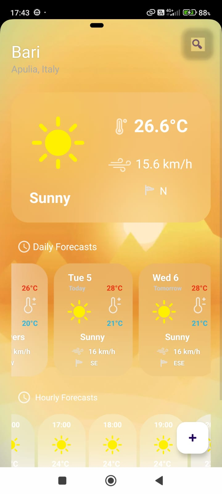

# ☀Multi Weather App⛈
Android Weather App in java that compares multiple Weather APIs/Scrapers to provide the best possible result, and shows average daily/hourly data from each API.

Here's a quick showcase:

https://github.com/user-attachments/assets/763279a8-5130-4173-9a73-e84c1c277445

# 📱 App & Gui

The empty app is a simple white page with 2 buttons, the "search" button on top right corner will pop up a text menu, once the user inserts a city name in it the APIs will fetch weather data for that location and display it to the user.

The background images change depening on the current weather forecast, there are like 7 different backgrounds stolen- ehm i mean borrowed from the internet, 10 considering the day/night variants. I wanted to keep a "simple cartoon asthetic, but also a bit corporate" vibe to the app so i chose these ones, you are free to change them. I also made a custom logo using canva.

The "plus" button on bottom right will show 2 more buttons, one to delete the current location from the location list, the other for a custom useless notification and a useless pop up menu. You are free to customize it if u want.

The user can add infinite locations and swipe through them, the user can also scroll through the scrollMenus used to dispay Daily and Hourly data. Clicking on each day will pop up its hourly data, which is also a Horizontal Scroll bar menu that displays each hour forecast.

Because weather stations are generally not very accurate, it's best not to consider forecasts data for days past the "day after tomorrow".

The user cannot delete every location, it has to keep at least one, dont ask me to fix this cuz im tired of this project.

# 💻 Code & Apis

The APIs i used are:

- GeoCodeMaps Api ([here](https://geocode.maps.co/));
- VisualCrossing Api ([here](https://www.visualcrossing.com/weather-query-builder/)), international;
- AccuWeather Api, ([here](https://developer.accuweather.com/)), international but requires location key from each city, which requires its Nation code, because of this i set this Api for italian cities only;
- OpenMeteo Api ([here](https://open-meteo.com/en/docs)), international;
- WeatherApi.com Api ([here](https://www.weatherapi.com/)), international;
- IlMeteo (scraper, [here](http://ilmeteo.it/meteo/)), only works for Italy and some general european locations;
- Windy (work in progress Api, [here](https://api.windy.com/)), international.

The code makes requests to the APIs to extract the current weather data, and the forecast data for the next few days, including hourly data. The weather informations are then saved into custom data types, an average result is calculated and displayed to the user. The daily data is saved into storage and updated every 2 hours for efficiency (and to not waste api requests).

Here's a video example of me adding Milan as a location, keep in mind that you can only add cities in italy because some of the apis i used only work for italy. You can fix this by changing some of the remaining apis and adding your local weather apis.

https://github.com/user-attachments/assets/79770668-a6a6-4da2-b6fe-901aaebff7f7

### 📊 Average Data Algorithm

When calculating the average weather condition (like cloudy or sunny), getting the "best median result" out of all apis is quite a difficult job because some apis are less accurate than others or give entirely different results, so what i did was using custom maps, dictionaries, other data types and algorithms to convert weather info into score points (i assigned more points to IlMeteo cuz its the best italian weather system imo), then calculating an average result out of those points, here are some examples:

- Cloudy = 2, so if 4 apis say Cloudy and the fifth one says 3 (rainy), the median is [(2x4)+3]/5 =^ 2, which means the final result will be Cloudy;
- Sunny = -1, so if 3 apis say Sunny and 2 say Showers (4), the median is more or less 1, which means the final result will be Cloudy, however it's highly unlikely that apis give such different conditions for the same location. 

Why isn't Sunny 0? because statistically (i mean from what i've experienced) if the weather says it's going to be a Sunny day, there aren't going to be sudden changes in the forecast and the weather will be almost certainly sunny through the whole day, so i might as well say -1 or -5 cuz the result will most likely not change, while if the forecast says cloudy then there might be chanches of rain, which means the calculations have to be more precise to accurately predict weather it's going to rain or not. I did not include the "chanche of rain" variable in the data types, however EVERY api i used has this value, if you want you can modify the entire code, fetch this value and add it to the data types. 

The average wind direction is calculated using radians of course, then turned into degrees and the string corresponding to the name of the direction (eg SSW for south-south-west). The remaining data like temperature and windspeed is a simple median calculation.

Next i might include my other project ([this one](https://github.com/Hue-Jhan/Noaa-Satellite-Decoder)) to fetch live data from satellites to get even more accurate weather informations and display them on screen.
